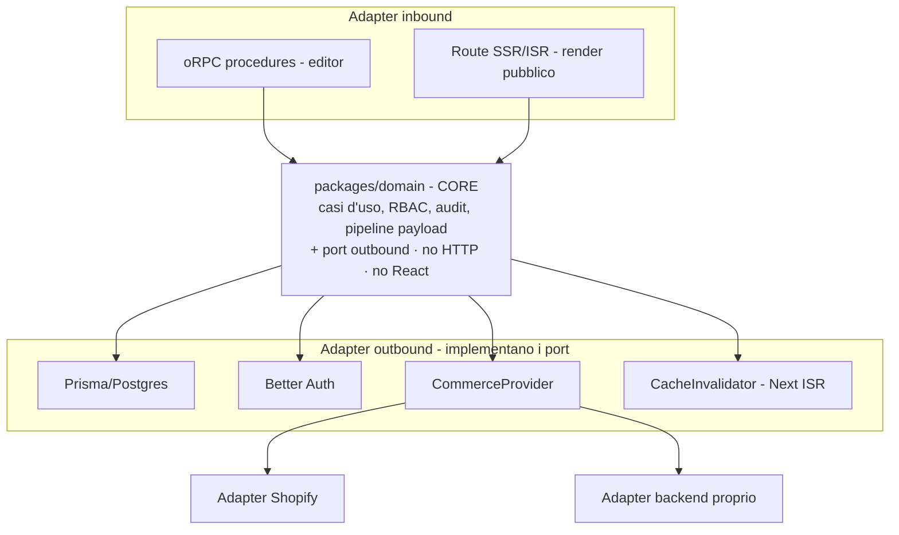
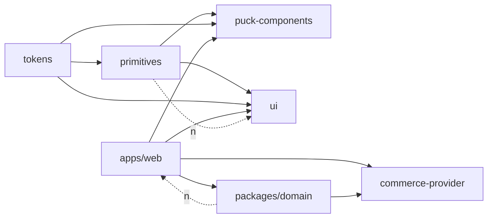

# Architecture Spine — page-builder

> Contratto di consistenza per la riscrittura. Fissa gli invarianti che tengono allineate unità costruite in modo indipendente; lo stack e la struttura sono seed (veri al cold-start, poi di proprietà del codice). Il razionale delle scelte vive nel `.memlog.md` di questo run.

## Design Paradigm

**Esagonale (Ports & Adapters) dentro un monolite Next.js fullstack.**

Un **core di dominio** framework-agnostic (niente HTTP, niente React) in `packages/domain` contiene tutti i casi d'uso — pages, versions, publish/rollback/archive/restore, RBAC, audit, pipeline payload (validazione/classificazione/sanitizzazione) — e i **port** verso l'esterno. Tutto il resto sono **adapter** attorno al core:

- **adapter inbound**: procedure oRPC (editor), route SSR/ISR (render pubblico).
- **adapter outbound** (implementano i port del core): persistenza (Prisma/Postgres), identità (Better Auth), sorgenti commerce (CommerceProvider), invalidazione cache (CacheInvalidator).



Il core è deliberatamente **estraibile**: se domani serve un'API standalone, le si mette sopra un adapter HTTP senza toccare il dominio.

## Invariants & Rules

Diagramma delle dipendenze consentite (chi può dipendere da chi). È **una regola**, non solo una vista.



### AD-1 — Core di dominio esagonale, unico punto di accesso al dominio

- **Binds:** CAP-6…CAP-14; ogni mutazione **e** lettura non-pubblica del dominio.
- **Prevents:** logica di dominio sparsa nel layer web, non riusabile e non enforced in un solo punto (la regressione legacy dei CRUD auto-generati scoperti).
- **Rule:** ogni **mutazione** di `Page`/`PageVersion`/`PageAssignment` e ogni **lettura non-pubblica** (dettaglio pagina non pubblicata, anteprima draft, storico versioni, audit) passa da un caso d'uso di `packages/domain`. Il core non importa React né tipi HTTP. **Nessun CRUD auto-generato** e nessun accesso Prisma diretto dagli adapter inbound espone entità di dominio scavalcando i casi d'uso. Unica eccezione (AD-4).

### AD-2 — Topologia monolite fullstack con core estraibile

- **Binds:** tutta l'app.
- **Prevents:** un contratto di rete da progettare/versionare e un hop extra per l'SSR, superflui per un greenfield a singolo sviluppatore.
- **Rule:** una sola app deployabile (`apps/web`) ospita editor + render + adapter. Il **core vive in `packages/domain`** (non dentro `apps/web`), senza dipendenze da React/HTTP/Next, così un'estrazione futura in servizio non tocca il dominio.

### AD-3 — Il frontend consuma il design system, non uno stack UI parallelo [ADOPTED]

- **Binds:** CAP-3, CAP-4, CAP-5, CAP-6; `apps/web`.
- **Prevents:** due stack UI paralleli e divergenti (il drift legacy: app su react-bootstrap invece delle composizioni del design system).
- **Rule:** `apps/web` costruisce la UI **solo** su `@penpot-ds/ui` + `@penpot-ds/primitives` (+ token). Vietato introdurre una libreria UI generica concorrente. Layering `tokens ← primitives ← {puck-components, ui}`; le primitive non importano da `ui` né conoscono il dominio page-builder.

### AD-4 — RBAC deny-by-default a copertura totale nel core; auth ≠ authz [ADOPTED]

- **Binds:** CAP-11, CAP-12, CAP-13; ogni via di lettura/scrittura del dominio.
- **Prevents:** authz sparsa tra provider auth e app; ruolo grossolano scambiato per permesso su risorsa; endpoint (write **o read**) che toccano dominio senza check.
- **Rule:** Better Auth fornisce **identità + ruolo grossolano** (`Principal { userId, role }`, `role ∈ {ADMIN, EDITOR, CLIENTE}`) nel context oRPC. L'**autorizzazione fine** (es. "questo Cliente è assegnato a questa pagina?" via `PageAssignment`; "questo campo è content o structure?") è **dato di dominio** decisa dal core, deny-by-default. Ogni adapter inbound passa il `Principal` al core; nessun adapter decide da sé. **Unica lettura anonima ammessa:** la versione PUBLISHED `by-slug` su una **proiezione pubblicata** (nessun campo interno/draft). La UI può nascondere, ma non è mai l'unico controllo.

### AD-5 — Payload Puck: una sola fonte di verità FE/BE (schemi Zod + classifier condivisi)

- **Binds:** CAP-4, CAP-6, CAP-13.
- **Prevents:** duplicazione/drift della classificazione structure/content (il dolore #1 del legacy: `field-classifier.json` duplicato a mano in Java) e payload non validato/non sanitizzato.
- **Rule:** gli schemi Zod dei blocchi e la classificazione structure/content vivono **una sola volta** in `packages/puck-components` e sono importati sia dall'editor sia dal core server. Alla scrittura/pubblicazione il core: (1) valida il payload contro gli schemi dei blocchi; (2) deriva structure/content dal classifier condiviso; (3) **sanitizza i campi content** (XSS) prima di persistere. Default per campo/blocco ignoto: `content` (fail-safe).

### AD-6 — Forma del payload, proprietà di id/versioni

- **Binds:** CAP-6, CAP-8, CAP-9, CAP-14.
- **Prevents:** riscrittura della struttura Puck; perdita del diff a livello di blocco; race sull'allocazione del numero di versione.
- **Rule:** il payload è la forma Puck `{content, root, zones}` con `schemaVersion`, persistito 1:1 in colonna `Json` (jsonb). **Proprietà:** i **block-id** sono coniati dal client e **immutabili** — il core non li riscrive mai; **`schemaVersion`** è di proprietà di `packages/puck-components`; il **`versionNumber`** è allocato dal **core in transazione**, con vincolo `UNIQUE(page_id, version_number)`.

### AD-7 — Coerenza di pubblicazione enforced dal DB e in transazione

- **Binds:** CAP-8, CAP-9, CAP-10, CAP-11.
- **Prevents:** due versioni PUBLISHED per pagina; pagina archiviata con una versione ancora pubblicata servita da SSG.
- **Rule:** l'invariante **≤1 PUBLISHED per pagina** è garantito da un **indice univoco parziale Postgres** (`UNIQUE (page_id) WHERE status='PUBLISHED'`), applicato via **migration SQL esplicita** — scelto per una garanzia autoritativa a livello DB indipendente dallo stato preview del DSL ORM, non come workaround di un bug. Publish/rollback/archive avvengono in **un'unica transazione** che accoppia `Page.status` e `PageVersion.status`: promuovere una versione demota la precedente; **archiviare una pagina demota la sua versione PUBLISHED**. Il DB è la rete di sicurezza autoritativa.

### AD-8 — Audit applicativo nel core, sui metadati, un solo writer

- **Binds:** CAP-14.
- **Prevents:** audit parziale o aggirabile; duplicazione dell'intero blob di contenuto; righe di audit di forma incompatibile.
- **Rule:** ogni caso d'uso di mutazione scrive tramite un **unico `AuditWriter`** una riga `AuditLog` di **forma canonica** (`actor`, `action`, `entityType`, `entityId`, `timestamp`, `metadataDiff` — **non** il payload intero). Copertura totale perché ogni mutazione passa dal core (AD-1). Consultabile solo da ADMIN. Lo storico dei **contenuti** resta modellato dalle `PageVersion`, non dall'audit.

### AD-9 — Render pubblico: SSG + ISR, invalidazione via port

- **Binds:** CAP-8, CAP-11.
- **Prevents:** HTML pubblico stantio dopo un publish; leak di bozze nella cache pubblica; accoppiamento del core a Next.
- **Rule:** le pagine pubbliche `by-slug` sono servite come **SSG + ISR** dalla proiezione pubblicata (AD-4). Il core resta **puro**: espone un port **`CacheInvalidator`** che un adapter implementa con `revalidateTag(slug)`/`revalidatePath`, invocato **post-commit** su publish/rollback/archive. Draft e published hanno **domini di cache disgiunti** (tag/funzioni di fetch distinti, mai condivisi); l'anteprima draft (`by-slug?version=draft`) è **render dinamico non cachato** e protetto da auth (AD-4).

### AD-10 — Integrazione commerce dietro il port CommerceProvider

- **Binds:** CAP-11; blocchi commerce; render storefront.
- **Prevents:** lock-in su una sorgente commerce; riscrittura dei blocchi al cambio/affiancamento di sorgente; chiamate commerce dirette sparse nei blocchi; DTO commerce incompatibili tra blocchi.
- **Rule:** i blocchi commerce (ProductCard/ProductGrid/AddToCart/…) e il render **non** parlano mai direttamente a Shopify o a un backend specifico, ma al **port `CommerceProvider`** con contratto canonico (metodi es. `getProduct`/`listProducts`/`getCollection`; DTO `ProductRef`, `Price { amount, currency }`, …). Adapter: Shopify (Storefront API GraphQL) e backend proprio. La risoluzione dati avviene **server-side a render-time** (`resolveData`/external fields di Puck).

### AD-11 — Pipeline Penpot→codice preservata, artefatti generati immutabili [ADOPTED]

- **Binds:** CAP-1, CAP-2.
- **Prevents:** valori di design inventati a mano e artefatti generati modificati fuori pipeline (drift design↔codice).
- **Rule:** Penpot resta single source of truth dei valori; token e componenti sono **generati** (data-driven dal catalogo Penpot) e marcati `@generated`, mai editati a mano; la rigenerazione preserva i file scritti a mano. Dettaglio → companion `penpot-pipeline.md`.

### AD-12 — Snapshot di contenuto immutabili

- **Binds:** CAP-7, CAP-8, CAP-9, CAP-12, CAP-13.
- **Prevents:** mutazione in-place della versione pubblicata; perdita di storico; un Cliente che altera struttura.
- **Rule:** ogni salvataggio di contenuto (autosave incluso) **crea sempre una nuova `PageVersion` DRAFT**; mai mutazione in-place di una versione esistente/pubblicata. Le modifiche **content-only del Cliente** creano una nuova DRAFT in cui solo i campi `content` (classifier, AD-5) sono modificabili; i campi `structure` sono bloccati e rifiutati dal core.

### AD-13 — Errori di dominio tipizzati e semantica 404/403

- **Binds:** tutte le procedure oRPC; AD-4.
- **Prevents:** shape errori divergenti tra unità; leak dell'esistenza di risorse a utenti non autorizzati.
- **Rule:** gli errori di dominio sono un **set tipizzato** mappato a un insieme fisso di errori oRPC (shape unico, non stringhe libere). Coerente col deny-by-default: su risorsa **non-pubblica** per cui il `Principal` non è autorizzato si risponde **404** (non si rivela l'esistenza), non 403; 403 è riservato ad azioni note-ma-vietate su risorse la cui esistenza è già lecita conoscere.

## Consistency Conventions

| Concern | Convention |
| --- | --- |
| Naming entità | `Page` (slug pubblico univoco), `PageVersion`, `PageAssignment` (Cliente↔pagina), `AuditLog`; `PageStatus` DRAFT/PUBLISHED/ARCHIVED, `PageVersionStatus` DRAFT/PUBLISHED |
| Confini package | `@penpot-ds/*` = design system; `packages/domain` = core (no React/HTTP); `packages/commerce-provider` = port + adapter |
| Contratti condivisi core-attraversanti | tipi canonici e proprietari unici: `Principal` (context oRPC), `AuditLog` (via `AuditWriter`), `CommerceProvider` DTO, `CacheInvalidator` port, errori di dominio tipizzati (AD-13) |
| Transport / errori | oRPC editor→dominio; OpenAPI derivato; errori di dominio tipizzati → set oRPC fisso (AD-13) |
| Dati & formati | id/date default Prisma/Postgres; payload `Json` (jsonb) forma Puck `{content,root,zones}`; block-id client-owned immutabili; `versionNumber` core-owned `UNIQUE(page_id, version_number)` |
| Auth | Better Auth (sessione cookie editor); `Principal + role` nel context oRPC; authz fine sempre nel core, deny-by-default (read **e** write) |
| Mutazione di stato | solo via casi d'uso del core; publish/rollback/archive in transazione che accoppia `Page.status`↔`PageVersion.status`; ogni save = nuova DRAFT (AD-12); ≤1 pubblicata come backstop DB |
| Cache | domini disgiunti draft/published; invalidazione post-commit via port `CacheInvalidator` (AD-9) |
| Validazione/sanitizzazione | schemi Zod dei blocchi condivisi FE/BE; sanitizzazione XSS dei campi `content` lato server prima di persist/publish |
| Accessibilità | baseline WCAG 2.1 AA obbligatoria per primitive/composizioni (companion `a11y-baseline.md`) |

## Stack

| Name | Version |
| --- | --- |
| TypeScript | ~5.7+ |
| Next.js (App Router) | 16.x |
| React | 19 |
| PostgreSQL | 18 |
| Prisma | 7.9+ |
| Better Auth | corrente (attivo lug 2026) |
| oRPC | corrente |
| @puckeditor/core | 0.22.x |
| Tailwind CSS | 4 |
| Node.js | LTS |
| pnpm | 10 |
| Turborepo | 2 |
| create-better-t-stack (scaffold) | 3.37.0 |

> Versioni verificate contro il registry npm al 2026-07-25 (`@measured/puck` è deprecato → `@puckeditor/core`; Next 16.x corrente; Prisma 7.9). Da riconfermare al momento dello scaffold; il codice diventa proprietario di questi pin una volta creato.

## Structural Seed

Workspace **greenfield** (oggi contiene solo `docs/` come riferimento legacy). Monorepo pnpm + Turborepo. I `packages/*` del design system sono **(ri)costruiti** in questa riscrittura guidati da SPEC+companion — token e primitive-artefatti **generati** via pipeline Penpot (AD-11); lo spine ne ratifica **ruoli e layering**, non un codice preesistente.

```text
page-builder/
  apps/
    web/                     # Next.js App Router — editor + render pubblico (adapter)
      app/
        (public)/[slug]/     # render storefront SSG+ISR, proiezione pubblicata (AD-4,9,10)
        (app)/               # editor autenticato — isole 'use client' (Puck)
      src/
        orpc/                # adapter inbound: procedure oRPC (Principal→core, AD-4)
        adapters/            # impl. dei port: Prisma, Better Auth, CacheInvalidator
  packages/
    domain/                  # CORE esagonale: casi d'uso, RBAC, audit, pipeline payload, PORT (AD-1,2,4,5,8)
    commerce-provider/       # port CommerceProvider + adapter Shopify/custom (AD-10)
    tokens/                  # @penpot-ds/tokens         (generato, AD-11)
    primitives/              # @penpot-ds/primitives     (AD-3)
    puck-components/          # @penpot-ds/puck-components — schemi Zod + classifier CONDIVISI, schemaVersion owner (AD-5,6)
    ui/                      # @penpot-ds/ui             (composizioni editor)
    scripts/                 # pipeline Penpot→codice     (AD-11)
    storybook/               # docs/playground
```

**Envelope operativo.** Ambienti dev/staging/prod. Deploy come **container Docker self-host** (Next `output: standalone`), Postgres containerizzato/gestito, portabile in un futuro ecosistema microservizi (no lock-in di piattaforma). Le **migration** (incluso l'indice parziale SQL di AD-7) girano via `prisma migrate deploy` in fase di **release, prima dell'avvio app**, con gate in CI. Secret via env/secret manager. Logging/monitoring: strategia nominata, dettaglio in Deferred. Dev: Docker Postgres.

## Capability → Architecture Map

| Capability | Lives in | Governed by |
| --- | --- | --- |
| CAP-1/CAP-2 pipeline Penpot→token/componenti | `packages/scripts`, `tokens`, `primitives` | AD-11 |
| CAP-3 primitive accessibili | `packages/primitives` | AD-3, a11y-baseline |
| CAP-4 blocchi Puck | `packages/puck-components` | AD-3, AD-5, AD-6 |
| CAP-5 composizioni editor | `packages/ui` | AD-3 |
| CAP-6 authoring drag-and-drop | `apps/web/(app)` + `packages/domain` | AD-1, AD-5, AD-6, AD-12 |
| CAP-7 autosave/bozza | core `save-version` + oRPC | AD-1, AD-4, AD-12 |
| CAP-8 versioning/publish | core `publish` + DB | AD-1, AD-7, AD-9 |
| CAP-9 rollback | core `rollback` + DB | AD-1, AD-7 |
| CAP-10 lifecycle archive/restore | core | AD-1, AD-7 |
| CAP-11 render pubblico by-slug | `apps/web/(public)/[slug]` | AD-4, AD-9, AD-10 |
| CAP-12 RBAC (Admin/Editor/Cliente) | core + Better Auth + `PageAssignment` | AD-4, AD-12 |
| CAP-13 structure/content | `packages/puck-components` + core | AD-5, AD-12 |
| CAP-14 audit trail | core `AuditWriter` → `AuditLog` | AD-8 |
| Integrazione commerce | `packages/commerce-provider` | AD-10 |

## Deferred

- **Sorgente commerce concreta** (Shopify vs backend proprio vs entrambi) e, se proprio, il suo linguaggio (candidato Java/Spring Boot come servizio *dietro* CommerceProvider). Rivedere quando il modello di business/ecosistema si concretizza; il port AD-10 tiene la scelta aperta senza costo.
- **Provider DB e orchestratore container concreti** (Neon/Supabase/self-managed; K8s/Compose). Decisione di deploy; l'envelope Docker li rende intercambiabili.
- **Logging/monitoring/backup/CI-CD di dettaglio** — strategia nominata nell'envelope; il dettaglio (stack osservabilità, cadenza backup, pipeline) si fissa in implementazione.
- **Better Auth come issuer OIDC/JWT per l'ecosistema** (SSO multi-servizio). Attivare quando esiste un secondo servizio da autenticare.
- **Migrazione `schemaVersion` del payload** — policy di upgrade quando `schemaVersion` cambia (contratto authoring↔render). Da fissare alla prima evoluzione degli schemi dei blocchi; oggi `schemaVersion` è dichiarata e posseduta da `puck-components` (AD-6).
- **Strategia di migrazione dati dal legacy Strapi** — fuori scope SPEC salvo re-ingaggio esplicito.
- **Envelope perf/latenza** (budget render/save) — da misurare in implementazione, non vincolato qui.
