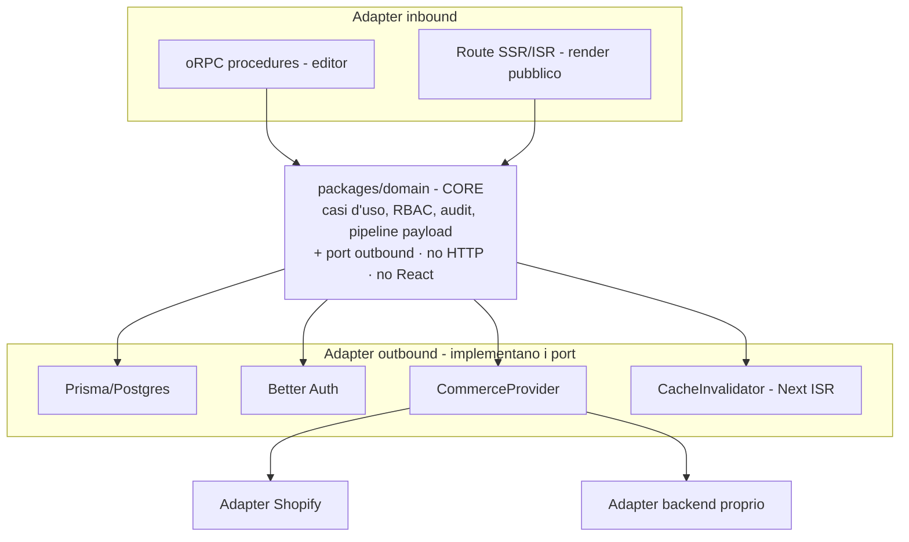
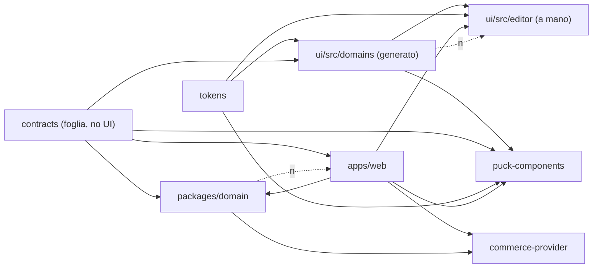

# Architecture Spine — page-builder

> Contratto di consistenza per la riscrittura. Fissa gli invarianti che tengono allineate unità costruite in modo indipendente; lo stack e la struttura sono seed (veri al cold-start, poi di proprietà del codice). Il razionale delle scelte vive nel `.memlog.md` di questo run.

## Design Paradigm

**Esagonale (Ports & Adapters) dentro un monolite Next.js fullstack.**

Un **core di dominio** framework-agnostic (niente HTTP, niente React) in `packages/domain` contiene tutti i casi d'uso — pages, versions, publish/rollback/archive/restore, RBAC, audit, pipeline payload (validazione/classificazione/sanitizzazione) — e i **port** verso l'esterno. Tutto il resto sono **adapter** attorno al core:

- **adapter inbound**: procedure oRPC (editor), route SSR/ISR (render pubblico).
- **adapter outbound** (implementano i port del core): persistenza (Prisma/Postgres), identità (Better Auth), sorgenti commerce (CommerceProvider), invalidazione cache (CacheInvalidator).


```mermaid
graph TD
  subgraph in [Adapter inbound]
    ORPC[oRPC procedures - editor]
    SSR[Route SSR/ISR - render pubblico]
  end
  CORE[packages/domain - CORE<br/>casi d'uso, RBAC, audit, pipeline payload<br/>+ port outbound · no HTTP · no React]
  subgraph out [Adapter outbound - implementano i port]
    PRISMA[Prisma/Postgres]
    AUTH[Better Auth]
    CP[CommerceProvider]
    CACHE[CacheInvalidator - Next ISR]
  end
  ORPC --> CORE
  SSR --> CORE
  CORE --> PRISMA
  CORE --> AUTH
  CORE --> CP
  CORE --> CACHE
  CP --> SHOPIFY[Adapter Shopify]
  CP --> CUSTOM[Adapter backend proprio]
```

Il core è deliberatamente **estraibile**: se domani serve un'API standalone, le si mette sopra un adapter HTTP senza toccare il dominio.

## Invariants & Rules

Diagramma delle dipendenze consentite (chi può dipendere da chi). È **una regola**, non solo una vista.


```mermaid
graph LR
  contracts["contracts (foglia, no UI)"]
  tokens --> domains["ui/src/domains (generato)"]
  contracts --> domains
  domains --> editor["ui/src/editor (a mano)"]
  domains --> puck[puck-components]
  contracts --> puck
  tokens --> puck
  tokens --> editor
  web[apps/web] --> editor
  web --> puck
  web --> core[packages/domain]
  web --> commerce[commerce-provider]
  contracts --> core
  contracts --> web
  core --> commerce
  core -.no.-> web
  domains -.no.-> editor
```

### AD-1 — Core di dominio esagonale, unico punto di accesso al dominio

- **Binds:** CAP-6…CAP-14; ogni mutazione **e** lettura non-pubblica del dominio.
- **Prevents:** logica di dominio sparsa nel layer web, non riusabile e non enforced in un solo punto (la regressione legacy dei CRUD auto-generati scoperti).
- **Rule:** ogni **mutazione** di `Page`/`PageVersion`/`PageAssignment` e ogni **lettura non-pubblica** (dettaglio pagina non pubblicata, anteprima draft, storico versioni, audit) passa da un caso d'uso di `packages/domain`. Il core non importa React né tipi HTTP. **Nessun CRUD auto-generato** e nessun accesso Prisma diretto dagli adapter inbound espone entità di dominio scavalcando i casi d'uso. Unica eccezione (AD-4).

### AD-2 — Topologia monolite fullstack con core estraibile

- **Binds:** tutta l'app.
- **Prevents:** un contratto di rete da progettare/versionare e un hop extra per l'SSR, superflui per un greenfield a singolo sviluppatore.
- **Rule:** una sola app deployabile (`apps/web`) ospita editor + render + adapter. Il **core vive in `packages/domain`** (non dentro `apps/web`), senza dipendenze da React/HTTP/Next, così un'estrazione futura in servizio non tocca il dominio.

### AD-3 — Il frontend consuma il design system, non uno stack UI parallelo [ADOPTED]

- **Binds:** CAP-3, CAP-4, CAP-5, CAP-6; `apps/web`.
- **Prevents:** due stack UI paralleli e divergenti (il drift legacy: app su react-bootstrap invece delle composizioni del design system).
- **Rule:** `apps/web` costruisce la UI **solo** su `@penpot-ds/ui` (+ token). Vietato introdurre una libreria UI **stilistica** concorrente. Le primitive **headless** (Base UI) non sono una libreria concorrente: non portano stile, sono la dipendenza di *comportamento* dichiarata per parte nel contratto di estrazione (AD-11), e sono importabili **solo** da `@penpot-ds/ui/src/domains/**` — mai da `apps/web`, mai da `editor/**`. Layering `contracts ← { ui/domains, puck-components, domain, render }; tokens ← ui{ domains ← editor } ← puck-components` — `contracts` è una foglia come `tokens`; `ui/domains` implementa i contratti, non li possiede (AD-5). **Regola di confine assoluta:** i componenti in `domains/` non conoscono il dominio page-builder e non importano mai da `editor/`. Persa la barriera di package con la fusione, il confine è tenuto da una **regola di lint bloccante in CI** e dai due export separati del package.

### AD-4 — RBAC deny-by-default a copertura totale nel core; auth ≠ authz [ADOPTED]

- **Binds:** CAP-11, CAP-12, CAP-13; ogni via di lettura/scrittura del dominio.
- **Prevents:** authz sparsa tra provider auth e app; ruolo grossolano scambiato per permesso su risorsa; endpoint (write **o read**) che toccano dominio senza check.
- **Rule:** Better Auth fornisce **identità + ruolo grossolano** (`Principal { userId, role }`, `role ∈ {ADMIN, EDITOR, CLIENTE}`) nel context oRPC. L'**autorizzazione fine** (es. "questo Cliente è assegnato a questa pagina?" via `PageAssignment`; "questo campo è content o structure?") è **dato di dominio** decisa dal core, deny-by-default. Ogni adapter inbound passa il `Principal` al core; nessun adapter decide da sé. **Unica lettura anonima ammessa:** la versione PUBLISHED `by-slug` su una **proiezione pubblicata** (nessun campo interno/draft). La UI può nascondere, ma non è mai l'unico controllo.

### AD-5 — Contratti dei componenti: una sola fonte di verità in `packages/contracts` [rivisto 2026-09-12]

- **Binds:** CAP-2, CAP-4, CAP-6, CAP-13.
- **Prevents:** duplicazione/drift della classificazione structure/content (il dolore #1 del legacy: `field-classifier.json` duplicato a mano in Java); payload non validato/non sanitizzato; **contratto disperso negli adapter (libreria, editor, render) che lega le pagine salvate a una libreria specifica**.
- **Rule:** `packages/contracts` (`@app/contracts`) contiene **una sola volta**: gli schemi Zod delle props di ogni componente/blocco, gli assi **`option`** (gli assi `state`/`behavior` sono di rendering e vivono nel contratto di estrazione, AD-11), i field, gli slot, il classifier structure/content e le **definizioni di sezione** (albero di blocchi del contratto + props + slot con `allow` e `max`). **Zero dipendenze** da React, Puck, Tailwind e da Penpot. È la porta; gli adapter sono `ui/domains` (libreria), `puck-components` (editor), render pubblico, `packages/domain` (validazione).
  Alla scrittura/pubblicazione il core: (1) valida il payload contro i contratti, inclusi `allow`/`max` degli slot (Puck 0.22 non ha `max` nativo: in editor si impone con `resolvePermissions`, **nel core è autoritativo**); (2) deriva structure/content dal classifier; (3) **sanitizza i campi content** (XSS) prima di persistere. Default per campo/blocco ignoto: `content` (fail-safe).
  **Sezioni rigide per default**: struttura bloccata, contenuto modificabile, aperte solo negli slot dichiarati — decisi da sviluppatore/admin, non dal designer. **Blocchi di layout a soli token**: Box (background, padding, radius, border), Flex (direction, align, justify, gap, wrap), Grid/Columns — tutti assi `option` a valori token, nessun colore o misura libera.

### AD-6 — Forma del payload, proprietà di id/versioni

- **Binds:** CAP-6, CAP-8, CAP-9, CAP-14.
- **Prevents:** riscrittura della struttura Puck; perdita del diff a livello di blocco; race sull'allocazione del numero di versione.
- **Rule:** il payload è la forma Puck `{content, root, zones}` con `schemaVersion`, persistito 1:1 in colonna `Json` (jsonb). **Proprietà:** i **block-id** sono coniati dal client e **immutabili** — il core non li riscrive mai; **`schemaVersion`** è di proprietà di `packages/contracts` — un cambio di contratto (nuovo asse o valore) è un bump esplicito; il **`versionNumber`** è allocato dal **core in transazione**, con vincolo `UNIQUE(page_id, version_number)`.

### AD-7 — Coerenza di pubblicazione enforced dal DB e in transazione

- **Binds:** CAP-8, CAP-9, CAP-10, CAP-11.
- **Prevents:** due versioni PUBLISHED per pagina; pagina archiviata con una versione ancora pubblicata servita da SSG.
- **Rule:** l'invariante **≤1 PUBLISHED per pagina** è garantito da un **indice univoco parziale Postgres** (`UNIQUE (page_id) WHERE status='PUBLISHED'`), applicato via **migration SQL esplicita** — scelto per una garanzia autoritativa a livello DB indipendente dallo stato preview del DSL ORM, non come workaround di un bug. Publish/rollback/archive avvengono in **un'unica transazione** che accoppia `Page.status` e `PageVersion.status`: promuovere una versione demota la precedente; **archiviare una pagina demota la sua versione PUBLISHED**. Il DB è la rete di sicurezza autoritativa.

### AD-8 — Audit applicativo nel core, sui metadati, un solo writer

- **Binds:** CAP-14.
- **Prevents:** audit parziale o aggirabile; duplicazione dell'intero blob di contenuto; righe di audit di forma incompatibile.
- **Rule:** ogni caso d'uso di mutazione scrive tramite un **unico `AuditWriter`** una riga `AuditLog` di **forma canonica** (`actor`, `action`, `entityType`, `entityId`, `timestamp`, `metadataDiff` — **non** il payload intero). Copertura totale perché ogni mutazione passa dal core (AD-1). Consultabile solo da ADMIN. Lo storico dei **contenuti** resta modellato dalle `PageVersion`, non dall'audit.

### AD-9 — Render pubblico: SSG + ISR, invalidazione via port

- **Binds:** CAP-8, CAP-11.
- **Prevents:** HTML pubblico stantio dopo un publish; leak di bozze nella cache pubblica; accoppiamento del core a Next.
- **Rule:** le pagine pubbliche `by-slug` sono servite come **SSG + ISR** dalla proiezione pubblicata (AD-4). Il core resta **puro**: espone un port **`CacheInvalidator`** che un adapter implementa con `revalidateTag(slug)`/`revalidatePath`, invocato **post-commit** su publish/rollback/archive. Draft e published hanno **domini di cache disgiunti** (tag/funzioni di fetch distinti, mai condivisi); l'anteprima draft (`by-slug?version=draft`) è **render dinamico non cachato** e protetto da auth (AD-4).

### AD-10 — Integrazione commerce dietro il port CommerceProvider

- **Binds:** CAP-11; blocchi commerce; render storefront.
- **Prevents:** lock-in su una sorgente commerce; riscrittura dei blocchi al cambio/affiancamento di sorgente; chiamate commerce dirette sparse nei blocchi; DTO commerce incompatibili tra blocchi.
- **Rule:** i blocchi commerce (ProductCard/ProductGrid/AddToCart/…) e il render **non** parlano mai direttamente a Shopify o a un backend specifico, ma al **port `CommerceProvider`** con contratto canonico (metodi es. `getProduct`/`listProducts`/`getCollection`; DTO `ProductRef`, `Price { amount, currency }`, …). Adapter: Shopify (Storefront API GraphQL) e backend proprio. La risoluzione dati avviene **server-side a render-time** (`resolveData`/external fields di Puck).

### AD-11 — Due contratti, una istantanea, un registro: il page builder possiede il vocabolario, l'estrazione possiede la lettura di Penpot e il render [ADOPTED, rivisto 2026-09-17 — v2, supera il regime fixture/ricetta/emitter delle revisioni 2026-09-12 e 2026-09-15]

- **Binds:** CAP-1, CAP-2, CAP-3, CAP-4.
- **Prevents:** valori di design inventati a mano; drift design↔codice; componenti generati non accessibili perché il design non esprime comportamento; generazione non riproducibile; **vocabolario delle props — e quindi le pagine salvate — legato alla libreria generata o a Penpot**; un caso di design (parte opzionale, ripetibile, immagine, albero) che blocca la pipeline perché il modello non lo sa dire.
- **Rule:**
  **Due contratti, dipendenza in un verso solo.** Il **contratto del page builder** (`@app/contracts`, AD-5, **nel fingerprint**) descrive solo ciò che l'editor e le pagine salvate usano: `name`, `version`, assi `option`, `fields` (testo, attributo, url, array), slot. Regola: ci sta solo ciò che cambia una pagina salvata o un campo dell'editor. Il **contratto di estrazione** (`packages/scripts/src/contracts/<nome>.extract.ts`, **fuori dal fingerprint**) importa il primo e dichiara come il componente si legge da Penpot e come si rende: assi `state`/`behavior`, parti con ruolo, `when` (parte presente solo per certi valori d'asse `option`), `repeat` (parte ripetuta su un field array), `parent` (albero con radice `root`), `layer`/alias, `element`, `content`/`attribute` verso i field, `headless` per parte, dominio, a11y con role per variante, container Penpot. Contraddire il contratto del page builder (field inesistente, tipo sbagliato, `when` su asse non `option`, albero senza radice o con cicli, parte senza ruolo) è errore **a module load**, che nomina parte e campo, prima di qualsiasi comando. Mai il contrario: il page builder non conosce Penpot. Una variante nuova è un cambio esplicito del contratto del page builder (`schemaVersion`), non una scoperta nell'istantanea. *Transizione (correct-course 2026-09-17):* fino alla rimozione della v1 (Story 2.16) il contratto del page builder tollera `parts`/`partRoles`/assi `state`-`behavior` come estensione deprecata **fuori dal fingerprint**, letta solo dalla v1; `SCHEMA_VERSION` sale una volta sola.
  **Tipi di asse**, dichiarati nei contratti e mai in Penpot: `option` (page builder: prop scelta in Puck → stile per variante), `state` (estrazione: browser → `hover:`/`focus-visible:`/`aria-invalid:`/`disabled:`, nessuna prop), `behavior` (estrazione: headless → `data-[state=…]:`, nessuna prop). Penpot disegna *tutti* gli assi come celle; una cella mancante è errore `contract`.
  **Ruolo di parte**, dichiarato nel **contratto di estrazione** e mai in Penpot: vocabolario chiuso `surface` · `text` · `icon` · `divider` · `image`, che dice che cosa la parte è e quindi quali proprietà porta. La tabella ruolo → proprietà ammesse vive nel **registro delle proprietà** in `packages/scripts`, unico e globale: l'unico posto dove si insegna una proprietà Penpot (token, e da v2 anche layout e posizione letti dal layer, così nessuna classe Tailwind entra a mano). `image` ammette raggio, opacità, layout, posizione e **nessun `fill`**: unica eccezione alla regola "token su ogni stile", perché il contenuto arriva dal field. Un token su una proprietà che il ruolo non ammette non passa in silenzio: si segnala per nome e si propone l'adattamento nell'ordine designer → registro (una volta per tutte) → contratto di estrazione (invariato dalla Story 2.10).
  **Legame componente→contratto:** SharedPluginData sul VariantContainer (`pagebuilder/contract = nome@versione`), scritto solo da `library`; il nome del container è controllo incrociato. `extract` fallisce su contratto dichiarato da due container, nome incoerente, contratto senza container.
  **Un solo artefatto generato:** l'**istantanea** `data/components/<nome>.json`, scritta solo da `extract` (tmp + rename, mai a mano), con `contract`, `provenance` (id Penpot, `readAt`, hash) e `cells[cella][parte]` = token per proprietà più layout/posizione. Validata contro i due contratti. Il suo diff in PR **è** la review del design; `extract --check` confronta Penpot live senza scrivere. `judgments/`, `bindings/`, `designs/`, `bases/`, `recipes/` e la coppia fixture+ricetta non esistono più. L'albero delle parti (`parent`) sostituisce il vincolo "profondità 1".
  **Nessuna base di libreria.** `render` genera `<Comp>.tsx`, `.test.tsx`, `.stories.tsx` e barrel — `@generated` con provenienza, a diff zero — da istantanea + contratto di estrazione + registro: `when` → render condizionale, `repeat` → `map`, `attribute` → attributo HTML, assi `state` → prefissi, `behavior` → `data-[state=…]:`, il **primitivo headless per parte** (Base UI, `headless: null` per chi non ne ha) è l'elemento della parte. Il **comportamento accessibile non è disegnabile in Penpot**: entra dal primitivo headless dichiarato nel contratto di estrazione, *input* del rendering, mai suo output. **Una sola libreria per installazione**: una seconda (es. MUI) è un altro contratto di estrazione sugli stessi contratti del page builder.
  **Sei comandi, un guscio, un errore:** `theme`, `library`, `extract`, `render`, `gates`, `propose`; `ScriptError { kind, component?, cell?, part?, detail }` con exit `1` input · `2` penpot · `3` contract · `4` gate. Solo `library` scrive su Penpot; solo `extract` scrive l'istantanea; `extract` e `render` non girano mai in CI né in build; `propose` stampa il diff dei contratti e non scrive mai. Dettaglio → `specs/spec-refactor-packages-scripts/commands.md`.
  **Composizione ≠ componente estratto.** Un componente composto (Accordion Root con più item), una hero o una sezione non sono componenti estratti: sono **definizioni di sezione** in `contracts` — alberi di dati (AD-5).
  **Componenti senza headless o con logica propria** (Table con sorting, Carousel, 3D, mappe): contratto completo come gli altri; in Penpot solo un **segnaposto** (dimensioni, etichetta, plugin data) non estratto; adapter scritto a mano, senza marker.
  **Scrittura su Penpot solo via skill e `library`:** bootstrap una tantum (rifiuta se la library esiste; crea anche i token shadow/ring), poi solo additiva; le differenze si segnalano, non si correggono. Nessuna sincronizzazione ricorrente codice→Penpot.
  **Pass/fail sta negli script e negli schemi, mai nel prompt di una skill.** Il principio della libertà del designer resta: si chiede di toccare Penpot solo per scelte di design vere.
  I file `@generated` non si editano a mano; i file senza marker sono sempre preservati. Dettaglio → companion `penpot-pipeline.md` (Stadio 2 v2) e `specs/spec-refactor-packages-scripts/`.

### AD-12 — Snapshot di contenuto immutabili

- **Binds:** CAP-7, CAP-8, CAP-9, CAP-12, CAP-13.
- **Prevents:** mutazione in-place della versione pubblicata; perdita di storico; un Cliente che altera struttura.
- **Rule:** ogni salvataggio di contenuto (autosave incluso) **crea sempre una nuova `PageVersion` DRAFT**; mai mutazione in-place di una versione esistente/pubblicata. Le modifiche **content-only del Cliente** creano una nuova DRAFT in cui solo i campi `content` (classifier, AD-5) sono modificabili; i campi `structure` sono bloccati e rifiutati dal core.

### AD-13 — Errori di dominio tipizzati e semantica 404/403

- **Binds:** tutte le procedure oRPC; AD-4.
- **Prevents:** shape errori divergenti tra unità; leak dell'esistenza di risorse a utenti non autorizzati.
- **Rule:** gli errori di dominio sono un **set tipizzato** mappato a un insieme fisso di errori oRPC (shape unico, non stringhe libere). Coerente col deny-by-default: su risorsa **non-pubblica** per cui il `Principal` non è autorizzato si risponde **404** (non si rivela l'esistenza), non 403; 403 è riservato ad azioni note-ma-vietate su risorse la cui esistenza è già lecita conoscere.

## Consistency Conventions

| Concern | Convention |
| --- | --- |
| Naming entità | `Page` (slug pubblico univoco), `PageVersion`, `PageAssignment` (Cliente↔pagina), `AuditLog`; `PageStatus` DRAFT/PUBLISHED/ARCHIVED, `PageVersionStatus` DRAFT/PUBLISHED |
| Confini package | `@app/contracts` = contratti dei componenti, classifier, definizioni di sezione (no React/Puck/UI); `@penpot-ds/*` = design system (`tokens` + `ui` + `puck-components`; nessun package `primitives`); `packages/domain` = core (no React/HTTP); `packages/commerce-provider` = port + adapter |
| Contratti condivisi core-attraversanti | tipi canonici e proprietari unici: `Principal` (context oRPC), `AuditLog` (via `AuditWriter`), `CommerceProvider` DTO, `CacheInvalidator` port, errori di dominio tipizzati (AD-13) |
| Transport / errori | oRPC editor→dominio; OpenAPI derivato; errori di dominio tipizzati → set oRPC fisso (AD-13) |
| Dati & formati | id/date default Prisma/Postgres; payload `Json` (jsonb) forma Puck `{content,root,zones}`; block-id client-owned immutabili; `versionNumber` core-owned `UNIQUE(page_id, version_number)` |
| Auth | Better Auth (sessione cookie editor); `Principal + role` nel context oRPC; authz fine sempre nel core, deny-by-default (read **e** write) |
| Mutazione di stato | solo via casi d'uso del core; publish/rollback/archive in transazione che accoppia `Page.status`↔`PageVersion.status`; ogni save = nuova DRAFT (AD-12); ≤1 pubblicata come backstop DB |
| Cache | domini disgiunti draft/published; invalidazione post-commit via port `CacheInvalidator` (AD-9) |
| Validazione/sanitizzazione | schemi Zod dei **contratti** (`@app/contracts`) condivisi FE/BE; sanitizzazione XSS dei campi `content` lato server prima di persist/publish |
| Accessibilità | baseline WCAG 2.1 AA obbligatoria per primitive/composizioni (companion `a11y-baseline.md`) |

## Stack

| Name | Version |
| --- | --- |
| TypeScript | ~6.0 |
| Next.js (App Router) | 16.x |
| React | 19 |
| PostgreSQL | 18 |
| Prisma | 7.9+ |
| Better Auth | corrente (attivo lug 2026) |
| oRPC | corrente |
| @puckeditor/core | 0.22.x |
| Tailwind CSS | 4 |
| Node.js | LTS |
| pnpm | 10 |
| Turborepo | 2 |
| create-better-t-stack (scaffold) | 3.37.0 |

> Versioni verificate contro il registry npm al 2026-07-25 (`@measured/puck` è deprecato → `@puckeditor/core`; Next 16.x corrente; Prisma 7.9). Da riconfermare al momento dello scaffold; il codice diventa proprietario di questi pin una volta creato.

## Structural Seed

Workspace **greenfield** (oggi contiene solo `docs/` come riferimento legacy). Monorepo pnpm + Turborepo. I `packages/*` del design system sono **(ri)costruiti** in questa riscrittura guidati da SPEC+companion — token e componenti `domains/` **generati** via pipeline Penpot (AD-11); lo spine ne ratifica **ruoli e layering**, non un codice preesistente.

```text
page-builder/
  apps/
    web/                     # Next.js App Router — editor + render pubblico (adapter)
      app/
        (public)/[slug]/     # render storefront SSG+ISR, proiezione pubblicata (AD-4,9,10)
        (app)/               # editor autenticato — isole 'use client' (Puck)
      src/
        orpc/                # adapter inbound: procedure oRPC (Principal→core, AD-4)
        adapters/            # impl. dei port: Prisma, Better Auth, CacheInvalidator
  packages/
    domain/                  # CORE esagonale: casi d'uso, RBAC, audit, pipeline payload, PORT (AD-1,2,4,5,8)
    commerce-provider/       # port CommerceProvider + adapter Shopify/custom (AD-10)
    contracts/               # @app/contracts — schemi props, tipi di asse, classifier, definizioni di sezione; zero dipendenze UI (AD-5, AD-6, AD-11)
    tokens/                  # @penpot-ds/tokens — GENERATO da Penpot (AD-11)
    ui/                      # @penpot-ds/ui — libreria componenti unica (AD-3, AD-11)
      src/domains/           #   GENERATO: data-display, inputs, feedback, layout,
                             #   navigation, overlays — Base UI headless + token, @generated
                             #   export `.`  → unico consumo per puck-components
      src/editor/            #   A MANO: composizioni di prodotto (TopBar, PageList,
                             #   LifecycleBadge, SaveStateIndicator, EmptyState, VersionList)
                             #   export `./editor` → unico consumo per apps/web (app)
    puck-components/         # @penpot-ds/puck-components — adapter Puck dei contratti: config, permissions, resolvePermissions (AD-5)
    scripts/                 # pipeline Penpot→codice (AD-11): contratti di estrazione, registro, sei comandi
      contracts/             #   <nome>.extract.ts — come si legge da Penpot e come si rende
      registry/              #   registro proprietà unico (token, layout, posizione) + tabella ruolo→proprietà
      penpot/                #   lettore MCP → istantanea data/components/<nome>.json
      render/                #   istantanea + contratto di estrazione + registro → tsx/test/story/barrel
      gates/                 #   render --check --all · suite ui · axe, report per componente
    storybook/               # docs/playground
```

**Envelope operativo.** Ambienti dev/staging/prod. Deploy come **container Docker self-host** (Next `output: standalone`), Postgres containerizzato/gestito, portabile in un futuro ecosistema microservizi (no lock-in di piattaforma). Le **migration** (incluso l'indice parziale SQL di AD-7) girano via `prisma migrate deploy` in fase di **release, prima dell'avvio app**, con gate in CI. Secret via env/secret manager. Logging/monitoring: strategia nominata, dettaglio in Deferred. Dev: Docker Postgres.

## Capability → Architecture Map

| Capability | Lives in | Governed by |
| --- | --- | --- |
| CAP-1/CAP-2 pipeline Penpot→token/componenti | `packages/scripts`, `tokens`, `ui/src/domains` | AD-11 |
| CAP-3 primitive accessibili | `packages/ui/src/domains` | AD-3, AD-11, a11y-baseline |
| CAP-4 blocchi Puck | `packages/contracts` + `packages/puck-components` | AD-3, AD-5, AD-6, AD-11 |
| CAP-5 composizioni editor | `packages/ui/src/editor` | AD-3 |
| CAP-6 authoring drag-and-drop | `apps/web/(app)` + `packages/domain` | AD-1, AD-5, AD-6, AD-12 |
| CAP-7 autosave/bozza | core `save-version` + oRPC | AD-1, AD-4, AD-12 |
| CAP-8 versioning/publish | core `publish` + DB | AD-1, AD-7, AD-9 |
| CAP-9 rollback | core `rollback` + DB | AD-1, AD-7 |
| CAP-10 lifecycle archive/restore | core | AD-1, AD-7 |
| CAP-11 render pubblico by-slug | `apps/web/(public)/[slug]` | AD-4, AD-9, AD-10 |
| CAP-12 RBAC (Admin/Editor/Cliente) | core + Better Auth + `PageAssignment` | AD-4, AD-12 |
| CAP-13 structure/content | `packages/contracts` + core | AD-5, AD-12 |
| CAP-14 audit trail | core `AuditWriter` → `AuditLog` | AD-8 |
| Integrazione commerce | `packages/commerce-provider` | AD-10 |

## Deferred

- **Sorgente commerce concreta** (Shopify vs backend proprio vs entrambi) e, se proprio, il suo linguaggio (candidato Java/Spring Boot come servizio *dietro* CommerceProvider). Rivedere quando il modello di business/ecosistema si concretizza; il port AD-10 tiene la scelta aperta senza costo.
- **Provider DB e orchestratore container concreti** (Neon/Supabase/self-managed; K8s/Compose). Decisione di deploy; l'envelope Docker li rende intercambiabili.
- **Logging/monitoring/backup/CI-CD di dettaglio** — strategia nominata nell'envelope; il dettaglio (stack osservabilità, cadenza backup, pipeline) si fissa in implementazione.
- **Better Auth come issuer OIDC/JWT per l'ecosistema** (SSO multi-servizio). Attivare quando esiste un secondo servizio da autenticare.
- **Migrazione `schemaVersion` del payload** — policy di upgrade quando `schemaVersion` cambia (contratto authoring↔render). Da fissare alla prima evoluzione degli schemi dei blocchi; oggi `schemaVersion` è dichiarata e posseduta da `contracts` (AD-6).
- **Strategia di migrazione dati dal legacy Strapi** — fuori scope SPEC salvo re-ingaggio esplicito.
- **Envelope perf/latenza** (budget render/save) — da misurare in implementazione, non vincolato qui.
- **Emitter per una seconda libreria (es. MUI).** Fattibilità dedotta dall'API tema MUI (`theme.components.*.variants`/`styleOverrides`), non eseguita. Riaprire alla prima richiesta concreta di una libreria non shadcn: contratti, sezioni, pagine salvate e core non cambiano; servono token rigenerati per il nuovo target e un adapter per componente (AD-11). *(Sostituisce la voce "Estensione della pipeline ai blocchi Puck", chiusa il 2026-09-12 da AD-5/AD-11: le sezioni sono definizioni di dati estratte da Penpot, i blocchi di layout sono a soli token.)* *Nota (2026-09-17): con la v2 la voce cambia forma — non "un emitter per libreria" ma "un contratto di estrazione per target"; contratti del page builder, sezioni, pagine salvate e core restano invariati, come già previsto.*
