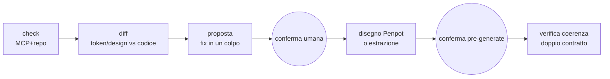

# Architecture Spine — penpot-estrazione-costruzione

> Contratto di consistenza per il sistema di estrazione live. Fissa gli invarianti che tengono coerenti gli step eseguiti dall'agente; stack e struttura sono seed. Il razionale vive nel `.memlog.md` di questo run. Eredita la parent spine page-builder 2026-07-25: i suoi AD restano validi salvo l'eccezione di scope dichiarata in AD-2.

## Design Paradigm

**Pipes-and-filters agentica, guidata dalla skill.** Nessun runtime dedicato, nessun nuovo package: la skill esegue stadi in sequenza — check → diff → proposta → conferma → disegno/estrazione → verifica. Ogni stadio legge stato live (Penpot via MCP + repo) e produce un output visibile all'umano; lo stadio successivo consuma solo quell'output, mai stato implicito. L'enforcement non è eseguibile: è la conferma umana in conversazione (AD-2).



## Inherited Invariants

Dalla parent spine `architecture-page-builder-2026-07-25` (binding, read-only, ID originali). Autorità completa nel documento parent.

| Inherited | From parent | Binds here |
| --- | --- | --- |
| Paradigma esagonale + monolite Next.js | parent §Design Paradigm | contesto: questo sistema è un produttore esterno del design system, non un adapter del core |
| AD-3 frontend su design system; headless solo in `ui/src/domains` | parent AD-3 | scelta da-zero vs headless (CAP-2): i primitivi headless atterrano solo in `domains/`, mai altrove |
| AD-5 `packages/contracts` unica fonte, zero dipendenze UI | parent AD-5 | gate componente-token: il contratto citato dal gate è quello di `contracts`, mai Penpot |
| AD-11 v2 due contratti, istantanea, registro, marker `@generated` | parent AD-11 | tutto tranne enforcement (vedi AD-2): istantanea, registro, file generati non toccati a mano restano validi |
| AD-6 payload Puck `{content,root,zones}`, `schemaVersion` di `contracts` | parent AD-6 | contratto token verso Puck/Tailwind theme (CAP-9): solo token, mai struttura |
| Layering `contracts ← domains ← {editor, puck}`; `tokens ← domains` | parent §dipendenze | direzione consentita di ciò che l'estrazione genera |

## Invariants & Rules

Direzione delle dipendenze consentite. È **una regola**, non solo una vista.

```mermaid
graph TD
  HUMAN((umano<br/>conferme)) --> SKILL[skill<br/>orchestrazione step]
  SKILL --> MCP[Penpot via MCP<br/>lettura struttura/token/screenshot<br/>+ scrittura proposta]
  SKILL --> REPO[repo<br/>profili · contracts · tokens · domains]
  SKILL -.mai senza sì.-> WRITE[scritture:<br/>Penpot · allineamenti · file]
  WRITE --> HUMAN
  SCRIPTS[packages/scripts<br/>comandi esistenti] -.non guidano<br/>questo flusso.-> SKILL
  TOKENS[packages/tokens<br/>@theme] --> PUCK[Puck futuro<br/>solo theme]
```

### AD-1 — Nessun runtime dedicato: la skill guida, niente nuovo package [ADOPTED]

- **Binds:** CAP-1…CAP-10; ogni step del flusso.
- **Prevents:** orchestrazione in script che reintroduce la rigidità che lo spec vuole uccidere; due driver (script + skill) che divergono su chi decide.
- **Rule:** il flusso vive come step della skill, eseguiti dall'agente via MCP + repo. Vietato creare package/moduli runtime per questo sistema e vietati file di metadati scritti a mano per singolo componente (`git grep` di metadati per-componente deve restare vuoto): la verità per-istanza sta live in Penpot, i profili (AD-4) descrivono specie versionate non istanze, gli unici artefatti per-componente persistiti sono generati (`@generated`, AD-11 parent). `packages/scripts` resta per i suoi comandi esistenti ma non guida né vincola questo flusso.

### AD-2 — Conferma umana in conversazione come unico gate; eccezione di scope ad AD-11 parent [ADOPTED]

- **Binds:** CAP-3, CAP-5, CAP-6, CAP-8.
- **Prevents:** avanzamento silenzioso; applicazione di fix o generazione senza consenso; verdetti impliciti non tracciabili; piano approvato per A eseguito su file B; sì di ieri riusati oggi.
- **Rule:** nessuno step con effetti parte senza sì esplicito in conversazione, con mappa fissa: H1 copre applicazione allineamento token E disegno/proposta su Penpot; H2 copre generazione file. Un sì vale un piano-diff numerato: N file = N voci dello stesso piano, con ordine dichiarato; una rilettura tra le scritture invalida il piano (si rifà lo stadio, AD-3). Persiste solo ciò che è ratifica (profili AD-4); i sì esecutivi non persistono mai e si riconfermano ogni sessione. Questa è un'eccezione di scope ad AD-11 parent ("pass/fail mai nel prompt di una skill"), che resta valido per tutto il resto del page builder; conseguenza dichiarata: garanzia convenzionale, non eseguibile.

### AD-3 — Step senza stato nascosto: base congelata, rilettura solo come invalidazione [ADOPTED]

- **Binds:** CAP-1, CAP-3, CAP-5, CAP-7.
- **Prevents:** stadi che consumano stato implicito di sessioni precedenti; diff non riproducibili; "mi fido di prima" al posto di rilettura live; basi miste (decisione su dati di ieri + dettaglio di oggi).
- **Rule:** ogni stadio rilegge Penpot via MCP + repo al momento dell'esecuzione e mostra fotografia e risultato all'umano prima di passare oltre. La fotografia congelata dello stadio è l'unica base decisionale dello stadio dopo: una rilettura successiva serve solo a invalidarla (drift rilevato → si rifà lo stadio, mai base mista). Mai cache, mai fixture come scorciatoia (conferma il vincolo SPEC).

### AD-4 — Profili headless+token in config versionata nel repo; default proposti, umano ratifica [ADOPTED]

- **Binds:** CAP-2, CAP-3.
- **Prevents:** configurazione orale/implicita che diverge tra sessioni; default invisibili che nessuno ha mai approvato; due profili incompatibili per formato o sede.
- **Rule:** un profilo = un file JSON in `packages/scripts/profiles/<nome>.json` (stesso package del dominio estrazione, niente nuovo package per AD-1), campi obbligatori `name`, `version`, `headless`, `tokens`; nient'altro è un profilo valido. Il validatore è la rilettura della skill + la ratifica umana: un profilo non ratificato non si usa. I default li propone la skill, l'umano li ratifica una volta; modifiche successive solo per proposta + conferma. Senza profilo corrispondente al segnale design: suggerimento, mai fail muto. I profili descrivono specie headless versionate, non istanze per componente: la verità per-istanza resta live in Penpot (zero metadati, AD-1).

### AD-5 — Mani solo su file hand-owned; mai su `@generated`; un token un solo proprietario [ADOPTED]

- **Binds:** CAP-3, CAP-8, CAP-9.
- **Prevents:** edit dell'agente su artefatti generati con drift dal generatore; sovrascritture cieche spacciate per allineamenti; stesso token scritto in due file con precedenza opposta.
- **Rule:** vietato editare a mano o via agente `tailwind-theme.css` generato e qualsiasi file `@generated`: l'unico scrittore lecito del generato è il generatore (`generate:theme`). Ordine di precedenza reale (a cascata): shadcn `<` extras `<` generato Penpot — quindi `tailwind-extras.css` è solo additivo (nomi nuovi mai presenti nel generato), mai override dello stesso nome. Cambiare un valore esistente = cambiare in Penpot + rigenerare, oppure rimuoverlo esplicitamente prima. Un token, un solo proprietario. Componenti esistenti: solo diff reviewabile, mai sostituzione integrale.

### AD-6 — Un solo vocabolario token verso Puck: Tailwind theme v4 [ADOPTED]

- **Binds:** CAP-9.
- **Prevents:** secondo vocabolario parallelo per Puck; classi/utility inventate fuori theme; accoppiamento Puck↔struttura generata.
- **Rule:** i token Penpot si mappano a theme variables `@theme` (Tailwind v4 CSS-first) consumate da Puck; Puck non riceve mai struttura da questo sistema. Installazione Puck differita (corrente `@puckeditor/core` 0.23.x al 2026-10-03, da riconfermare all'installazione contro parent che cita 0.22.x).

### AD-7 — Fedeltà uguale giudizio umano; coerenza Penpot→React verificata a H2; riferimento opzionale [ADOPTED]

- **Binds:** CAP-7, CAP-10.
- **Prevents:** score automatici che sostituiscono il giudizio; React che deriva senza verifica dalla lettura Penpot; demo card bloccata perché manca il materiale di riferimento.
- **Rule:** contratto 1 giudicato dall'umano con segnalazione esplicita; nessuno score pixel-perfect. Contratto 2 verificato al gate H2: l'umano confronta i file proposti con la lettura Penpot congelata (AD-3) — struttura e token devono rispecchiarla, scostamenti solo se segnalati. Il riferimento vive in `_bmad-output/specs/spec-penpot-estrazione-costruzione/assets/card-reference/` (`screenshot.png` + `penpot-link.md`); se assente si procede con segnalazione, senza bloccare.

### AD-8 — Il gate ha un contenuto: cosa si verifica prima del sì [ADOPTED]

- **Binds:** CAP-6.
- **Prevents:** gate vuoto in cui il sì umano approva alla cieca; legame componente-token affermato ma mai controllato; nomi fuori convenzione che passano in silenzio.
- **Rule:** prima di chiedere il sì, la skill mostra l'esito dei quattro controlli contro le convenzioni ereditate: (1) il contratto dichiarato dal container Penpot (plugin-data `nome@versione`) esiste in `packages/contracts`; (2) i ruoli di parte sono nel vocabolario chiuso del registro; (3) ogni token usato sta nel vocabolario theme, altrimenti è proposta designer→registro→contratto; (4) nomi in kebab/PascalCase/`IDENTIFIER`. Esito go/no-go per voce + proposta dove no-go. Il sì umano conferma l'esito mostrato, non lo sostituisce.

### AD-9 — Livelli L0→L3 sequenziali: il successivo resta bloccato [ADOPTED]

- **Binds:** CAP-9.
- **Prevents:** estrazione di molecole/organismi su atomi mai validati; roadmap aggirata per fretta su un singolo componente.
- **Rule:** L0 Token → L1 Atomi → L2 Molecole → L3 Organismi; un livello si apre solo quando ogni sua entità ha passato check + gate + doppio contratto fedeltà. La roadmap vive in `scope-roadmap.md`; derogarvi richiede decisione esplicita registrata, non silenzio.

## Consistency Conventions

| Concern | Convention |
| --- | --- |
| Naming | ereditate: contratti kebab-case, container Penpot PascalCase, plugin-data `nome@versione`, assi `asse=valore\|…`; `data/components/<kebab>.json` è istantanea generata v2 (AD-11 parent), mai metadato a mano |
| Profili config | JSON in `packages/scripts/profiles/<nome>.json`; campi obbligatori `name`, `version`, `headless`, `tokens`; validatore = rilettura skill + ratifica umana |
| Diff | base sempre congelata e mostrata (AD-3); formato: voce per file con prima/dopo; piano numerato per H1/H2 (AD-2) |
| Mutazione di stato | solo via step confermati su piano numerato con ordine dichiarato (AD-2); rilettura tra scritture invalida il piano; mai parziali silenziosi |
| Errori | mai errore secco: ogni mismatch produce diff + proposta applicabile; il blocco è sempre spiegato e sbloccabile dal sì umano |
| Log di run | la conversazione è il log operativo; ciò che deve sopravvivere alla sessione va nel file giusto (profili, extras, memlog di spec) non in chat |
| Accessibilità | il comportamento accessibile entra dal primitivo headless dichiarato (AD-11 parent), mai disegnato in Penpot |
| Headless | `@base-ui/react` (rinominato da `@base-ui-components/react`), corrente 1.8.0 al 2026-10-03; non ancora installato nel repo — installare al primo profilo headless (L1) |

## Stack

Seed verificato al 2026-10-03 (web + repo); il codice possiede questi pin una volta installati.

| Name | Version |
| --- | --- |
| Tailwind CSS (CSS-first, `@theme`) | ^4.3.2 (installato, da catalogo pnpm) |
| `@base-ui/react` (headless) | ^1.8.0 (corrente al 2026-10-03; non ancora installato — installare a L1) |
| `@puckeditor/core` | 0.23.x corrente al 2026-10-03 (non installato; differito a Epic 3/4, riconfermare) |
| Penpot self-hosted + MCP ufficiale | come da setup repo (`docker/penpot`, `PENPOT_MCP_TOKEN`) |
| pnpm / Turborepo / Node | 10 / 2 / >=22.13 <23 (ereditati dal repo) |

## Structural Seed

Nessuna nuova directory runtime. Solo due path convenzionati (già esistente il secondo):

```text
packages/scripts/profiles/<nome>.json  # profili headless+token (AD-4, hand-owned versionati)
_bmad-output/specs/spec-penpot-estrazione-costruzione/assets/card-reference/  # screenshot.png + penpot-link.md, opzionale
packages/tokens/src/tailwind-extras.css  # unico file theme toccabile per proposta (hand-owned)
```

## Capability → Architecture Map

| Capability / Area | Lives in | Governed by |
| --- | --- | --- |
| CAP-1 costruzione live MCP | step check della skill + MCP Penpot | AD-1, AD-3 |
| CAP-2 scelta da-zero/headless, profili | config profili nel repo + step skill | AD-4, AD-3 (headless) |
| CAP-3 check iniziale + diff + proposta | step check/diff/proposta + conferma | AD-2, AD-3, AD-5 |
| CAP-4 contratto vivo zero metadati | segnali MCP + convenzioni repo, nessun file per-componente | AD-1 |
| CAP-5 regole come fix + conferma | step proposta + conferma pre-generate | AD-2 |
| CAP-6 auto-proposta Penpot + gate | scrittura MCP + gate contenuto + mappa H1/H2 | AD-8, AD-2, AD-5 (naming) |
| CAP-7 doppio contratto fedeltà | giudizio umano + verifica H2 + riferimento opzionale | AD-7, AD-2 |
| CAP-8 update solo diff | piano numerato, disciplina scritture agent-side | AD-5, AD-2 |
| CAP-9 scope L0-L3, Puck via theme | roadmap spec + `@theme` tokens, livelli sequenziali | AD-9, AD-6, AD-5 |
| CAP-10 validazione card end-to-end | demo guidata dalla skill | AD-7, AD-3 |

## Deferred

- **Contenuto del primo profilo reale**: schema e sede decisi (AD-4); i valori dei default si fissano alla prima authoring — la skill propone, l'umano ratifica.
- **Installazione Puck e forma della config blocchi**: a Epic 3/4; riconfermare versione `@puckeditor/core` (0.23.x al 2026-10-03).
- **Reintroduzione di verifier eseguibili**: se la garanzia convenzionale di AD-2 dovesse mordersi (gate saltato in silenzio), reintrodurre check di lettura senza cambiare modello — la skill resta il driver, il codice verifica.
- **Traccia persistente dei verdetti di fedeltà**: oggi basta la conferma in conversazione (decisione utente); rivalutare se servirà audit delle decisioni di design.
- **Rapporto a lungo termine con `packages/scripts`**: gli script restano per i loro comandi; se il sistema live li rende superflui, la dismissione è una correct-course separata, non di questa spine.
- **Emitter seconda libreria (es. MUI)**: ereditato dal Deferred parent — invariato.
